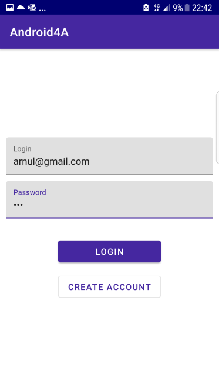
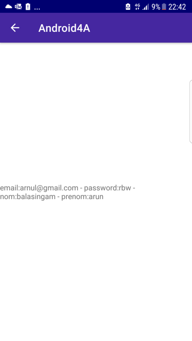

# Application pour se connecter à un compte

## Description
Ce projet a pour but de prolonger nos connaissance sur AndroidStudio.
Il permet d'aborder plusieurs éléments clef: MVVM ,Clean architecture, test Unitaire , page login et le langage Kotlin.

## Contenu demandé pour l'application
-MVVM 
-Clean architecture 
-test Unitaire  
-page login 
-langage Kotlin

ajout bonus:
-gitflow

## Aperçu de l'application

### Premier écran
On voit ci-dessous la page de connection :

### Ecran détail
Ici nous voyons dans cette images les information de l'utilisateur après sa connection:

## Ajout futur

Prochainement nous pourrons trouver dans cette application ces differents aspects:

- API
- RecyclerView
